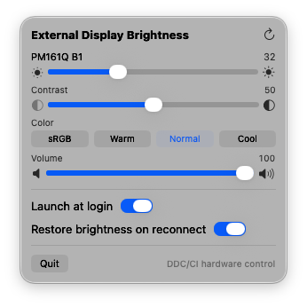
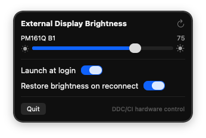

# BrightnessBar — hardware brightness for external displays on macOS


A menu bar app that changes the **actual backlight** of external monitors
over DDC/CI — exactly like pressing the monitor's physical buttons. No
overlays, no gamma tables, no software dimming.

Built and verified against an **Acer PM161Q B1** portable monitor connected
to a Mac mini M4 over a single USB-C cable (DisplayPort Alt Mode). See
[docs/FEASIBILITY.md](docs/FEASIBILITY.md) for the hardware investigation
with raw wire captures, and [docs/ARCHITECTURE.md](docs/ARCHITECTURE.md)
for the design.

<p align="center">
  
  
</p>

## Install (one command)

```bash
curl -fsSL https://raw.githubusercontent.com/hiteshsuthar1410/MacOS-External-Display-Brightness-Controller/main/install.sh | bash
```

This builds the app from source and installs it to `/Applications`.
Building locally (rather than downloading a binary) means no Gatekeeper
"unidentified developer" warnings and no quarantine prompts.

Or from a clone:

```bash
git clone https://github.com/hiteshsuthar1410/MacOS-External-Display-Brightness-Controller.git
cd MacOS-External-Display-Brightness-Controller
./install.sh
```

**Requirements:** Apple Silicon Mac (M1 or later), macOS 26+, and the Xcode
command-line tools (`xcode-select --install`). No root, no entitlements,
no permission prompts.

## What you get

A ☀️ icon in the menu bar with:

- A **native slider per external display** driving the monitor's real
  backlight over DDC/CI. Writes are debounced so dragging stays smooth;
  values re-sync from the hardware every time the menu opens, so changes
  made with the monitor's physical buttons show up correctly.
- **Launch at login** toggle.
- **Restore brightness on reconnect** — remembers the last brightness per
  display (keyed by EDID identity) and reapplies it when that display
  reconnects, if enabled.
- Automatic re-discovery when displays are plugged or unplugged.

> **Why not inside macOS's own brightness menu?** Control Center's Display
> module only lists Apple-protocol displays (built-in panels, Studio
> Display, Pro Display XDR) and has no extension point for third-party
> displays. macOS 26's Controls API allows third-party buttons/toggles in
> Control Center, but not sliders inside the Display module. A menu bar
> item is the closest native-feeling equivalent — the same approach
> MonitorControl and Lunar use.

## How it works

On Apple Silicon, each external display's DDC/CI channel is exposed in the
IORegistry as a `DCPAVServiceProxy` node (`Location = External`). IOKit
exports unheadered functions (`IOAVServiceCreateWithService`,
`IOAVServiceReadI2C`, `IOAVServiceWriteI2C`, `IOAVServiceCopyEDID`) that
perform raw I2C transactions on that bus. The `DDCKit` library in this
package binds those four symbols from pure Swift and implements the VESA
DDC/CI protocol (MCCS Get/Set VCP) on top, with an actor serializing bus
access. The app is a thin SwiftUI layer over `DDCKit`.

Every brightness change is written to the monitor and the monitor's own
value is read back — a moved slider reflects what the hardware actually
did, not merely that a command was sent.

## Troubleshooting

- **No slider / "No DDC-capable external displays found":** wake the
  display (monitors park their DDC interface when asleep), then click the
  refresh button in the menu.
- **Connected through a dock or adapter:** some adapters drop the DDC
  lines. Prefer a direct cable.
- **Values fight with other software:** quit other DDC tools
  (MonitorControl, Lunar, BetterDisplay) — two masters on one DDC bus
  confuse cheap monitor scalers.
- **"Launch at login" is greyed out:** it needs the installed `.app`
  bundle. Use `./install.sh` (or `Scripts/make-app.sh`) rather than
  `swift run`.

## Known limitations

- Intel Macs are unsupported (they use a different, legacy DDC path).
- Apple displays (built-in, Studio Display, Pro Display XDR) don't speak
  DDC/CI and are intentionally excluded; macOS already provides brightness
  keys for them.
- The `IOAVService` functions are exported by IOKit but unheadered — a
  private API surface, stable since macOS 11 and shared with
  MonitorControl/Lunar/BetterDisplay/m1ddc, but not contractual.
- Some monitors (including the PM161Q) under-report their features in the
  MCCS capabilities string; DDCKit trusts empirical reads instead.

## Building for development

```bash
swift build                     # debug build
./Scripts/make-app.sh           # release .app bundle → dist/BrightnessBar.app
```

## Package layout

```
Package.swift
Sources/
  DDCKit/         # library: discovery, DDC/CI protocol, EDID, errors
  BrightnessBar/  # SwiftUI menu bar app
Scripts/
  make-app.sh     # wraps BrightnessBar in a signed .app bundle
install.sh        # end-user installer
docs/
  FEASIBILITY.md
  ARCHITECTURE.md
```
